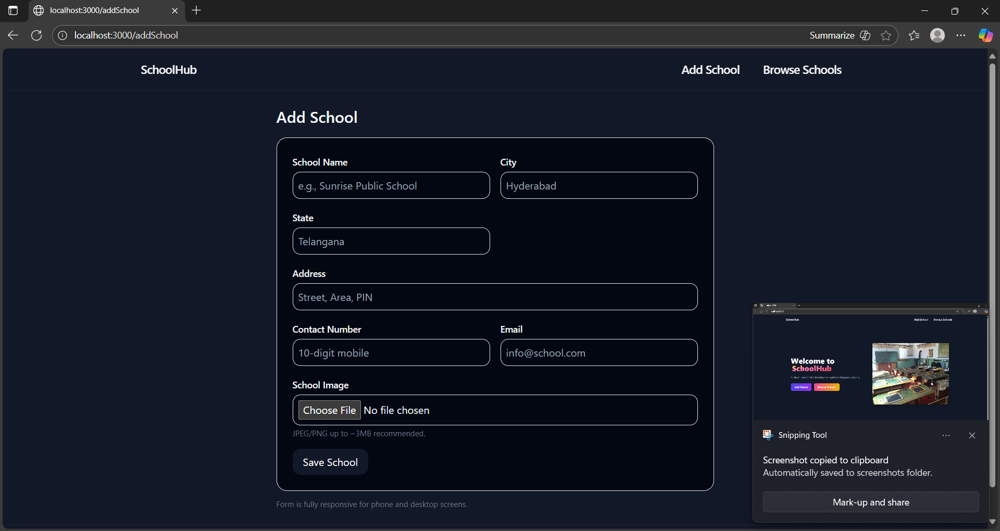

# SchoolHub

A modern, responsive web app for adding and browsing schools. Built with [Next.js](https://nextjs.org/) and [Tailwind CSS](https://tailwindcss.com/).

## ✨ Features

- Add new schools with details and images
- Browse and filter schools by city, state, and search query
- Responsive design for desktop and mobile
- Clean, colorful UI with smooth interactions

## 🚀 Getting Started

### Prerequisites

- Node.js (v18+ recommended)
- MySQL database

### Setup

1. **Clone the repository:**
   ```bash
   git clone https://github.com/your-username/schools-assignment-nextjs.git
   cd schools-assignment-nextjs
   ```

2. **Install dependencies:**
   ```bash
   npm install
   ```

3. **Configure environment variables:**
   - Copy `.env.local.example` to `.env.local` and update with your MySQL credentials:
     ```
     MYSQL_HOST=localhost
     MYSQL_PORT=3306
     MYSQL_USER=root
     MYSQL_PASSWORD=yourpassword
     MYSQL_DATABASE=schoolsdb
     ```

4. **Run database migrations (if any):**
   - Create the `schoolsdb` database and required tables.

5. **Start the development server:**
   ```bash
   npm run dev
   ```

6. ## 🚀 Live Demo
👉 [Click here to view SchoolHub](https://myschoolhub.vercel.app)

## 🖼️ Screenshots

| Home Page | Add School | Browse Schools |
|-----------|------------|---------------|
|  |  |  |

## 🗂️ Project Structure

```
schools-assignment-nextjs/
├── components/      # Reusable UI components (Navbar, SchoolCard, etc.)
├── pages/           # Next.js pages (index.js, addSchool.jsx, showSchools.jsx)
├── public/          # Static assets (images, favicon)
├── styles/          # Global and component styles (Tailwind)
├── utils/           # Utility functions (optional)
├── .env.local       # Environment variables
└── README.md        # Project documentation
```

## 🛠️ Technologies Used

- [Next.js](https://nextjs.org/)
- [React](https://react.dev/)
- [Tailwind CSS](https://tailwindcss.com/)
- [MySQL](https://www.mysql.com/)

## 📄 License

This project is for educational purposes as part of a web development assignment.

---
